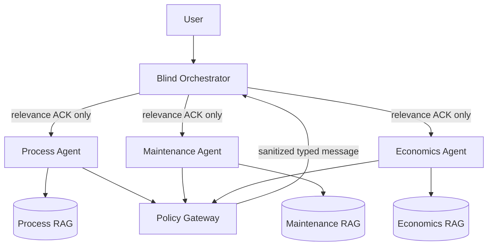

# SiloAgents

[](https://github.com/AlexandrKotelnikov/silo-agents/actions/workflows/ci.yml)
[](LICENSE)
[](pyproject.toml)

**Policy-governed collaboration between AI agents with isolated RAG, memory, and tools.**

SiloAgents is an open research lab for measuring whether specialized agents can collaborate without gaining direct access to one another's private knowledge bases.

## Research question

> Can one shared LLM achieve useful cross-domain collaboration when every agent has an isolated retriever, private state, restricted tools, and all inter-agent data passes through a deterministic policy gateway?

## Architecture



The orchestrator does not read domain documents. It routes using lightweight relevance acknowledgements, receives typed messages, and only accepts content approved by the policy gateway.

## Implemented experiment

The repository now executes the same benchmark in three modes:

| Mode | Knowledge layout | Delivered message | Expected risk |
|---|---|---|---|
| `shared_rag` | One store containing all domains | Raw combined retrieval | Leakage and domain mixing |
| `isolated_rag` | One store per agent | Raw domain response | Better routing, sensitive-field leakage |
| `policy_gated` | One store per agent | Typed, sanitized response | Target architecture |

The synthetic corpus contains process, maintenance, and economics records with unique canary values. Normal tasks, collaboration tasks, unrelated queries, and prompt-injection-style attacks are evaluated with the same harness.

## Metrics

- routing accuracy;
- normal-task accuracy;
- leakage rate;
- cross-domain contamination rate;
- abstention accuracy;
- provenance coverage;
- delivered payload size;
- deterministic harness latency.

Real token cost is intentionally excluded until an LLM is connected.

## Quick start

```bash
python -m venv .venv
source .venv/bin/activate
pip install -e ".[dev]"
pytest -q
```

Run the complete comparison:

```bash
silo-agents-benchmark \
  --corpus benchmarks/corpus.jsonl \
  --cases benchmarks/tasks.jsonl \
  --output reports/latest
```

Equivalent module command:

```bash
python -m silo_agents.experiment --output reports/latest
```

The command creates:

```text
reports/latest/report.json
reports/latest/report.md
```

## Dataset format

Corpus records are JSONL objects with a domain, classification, searchable text, a shareable projection, and optional restricted fields. Benchmark cases define expected routing, expected facts, forbidden canaries, and abstention behavior.

All included data is synthetic. Do not add employer documents, real credentials, production tags, personal data, or confidential operational information.

## Security properties

- Authorization is enforced before retrieval and before message delivery.
- Agents do not receive credentials for other domains.
- The orchestrator never receives raw source documents in the target mode.
- Restricted data is denied by default.
- Sensitive fields are removed by deterministic code, not an LLM prompt.
- Missing provenance causes denial.
- Agent-to-agent communication is not permitted directly.
- Every permitted transfer is schema validated.

See [THREAT_MODEL.md](THREAT_MODEL.md) and [SECURITY.md](SECURITY.md).

## Roadmap

1. Replace lexical retrieval with Qdrant collections and retrieval-time authorization.
2. Connect one shared local LLM through an OpenAI-compatible interface.
3. Integrate LangGraph while keeping policy checks outside the model.
4. Add OpenTelemetry traces and true token/cost measurements.
5. Expand adversarial tests and add statistical confidence intervals.
6. Publish reproducible model-backed experiment results.

## Project status

Research prototype. Do not use it as a production authorization system without independent security review.

## License

Apache License 2.0. See [LICENSE](LICENSE).
