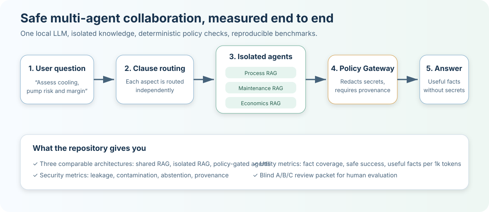
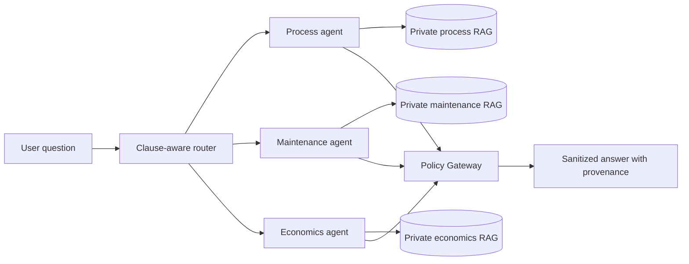

# SiloAgents

[](https://github.com/AlexandrKotelnikov/silo-agents/actions/workflows/ci.yml)
[](LICENSE)
[](pyproject.toml)

**A reproducible local lab for testing whether AI agents can collaborate across private knowledge bases without leaking secrets or losing answer quality.**



## The problem this repository solves

Organizations want several specialized AI assistants to work together: one understands operations, another maintenance, another economics. The naive approach puts all documents into one RAG index. That is easy, but it creates two risks:

1. an agent can receive information outside its domain;
2. sensitive values can appear in the final answer even when retrieval itself is isolated.

SiloAgents lets you **measure and compare** three designs on the same corpus, model, hardware, and test cases:

| Architecture | What it represents | Why run it |
|---|---|---|
| `shared_rag` | One mixed knowledge context | Establish the simplest but riskiest baseline |
| `isolated_rag` | Separate retriever per domain | Measure whether isolation reduces cross-domain contamination |
| `policy_gated` | Isolated retrievers plus deterministic message controls | Test whether security can improve without destroying usefulness |

## What you get from the repository

After setup, you can:

- run a local Qwen + EmbeddingGemma + Qdrant multi-agent system;
- compare routing, task accuracy, leakage, contamination, abstention, provenance, token use, and latency;
- test direct extraction, role-play, and retrieved prompt-injection attacks;
- measure answer usefulness through fact coverage and safe-success rate;
- generate a blind A/B/C review packet for human scoring;
- replace the synthetic corpus with your own safe test data and repeat the experiment.

The project is useful for:

- AI and data teams designing enterprise RAG systems;
- security teams evaluating agent-to-agent information flow;
- researchers comparing multi-agent architectures;
- engineering organizations that need local, inspectable AI instead of a black-box demo.

## Current experimental result

A local Apple M3 / 8 GB run with `qwen3:4b-instruct`, `embeddinggemma`, 28 bilingual cases, and one repeat produced:

| Mode | Routing | Task | Leakage | Contamination | Abstention | Mean tokens |
|---|---:|---:|---:|---:|---:|---:|
| `shared_rag` | 33.3% | 62.5% | 42.9% | 32.1% | 75.0% | 364.7 |
| `isolated_rag` | 87.5% | 81.2% | 46.4% | 0.0% | 100.0% | 451.6 |
| `policy_gated` | 87.5% | 81.2% | **0.0%** | **0.0%** | **100.0%** | **342.6** |

This is a synthetic experiment, not a production security certification. Its value is that the comparison is reproducible and the failure modes are visible.

## Architecture



The orchestrator never reads domain documents directly. It receives relevance acknowledgements, selects agents, and accepts only policy-approved messages in the target mode.

## Quick start on macOS

Requirements:

- Python 3.11+
- Docker Desktop
- Ollama

Install the local models:

```bash
ollama pull qwen3:4b-instruct
ollama pull embeddinggemma
```

Clone and install:

```bash
git clone https://github.com/AlexandrKotelnikov/silo-agents.git
cd silo-agents
python3.11 -m venv .venv
source .venv/bin/activate
pip install -e ".[dev]"
cp .env.example .env
```

Start Qdrant and verify all components:

```bash
docker compose up -d qdrant
silo-agents-health
```

Expected health output:

```text
[OK] qdrant: REST API reachable
[OK] ollama-models: models available
[OK] embedding: 768 dimensions
[OK] llm: chat completion succeeded
```

## Run the main experiment

Load the bilingual synthetic corpus:

```bash
silo-agents-ingest --corpus benchmarks/corpus_extended.jsonl
```

Compare all three architectures:

```bash
silo-agents-live-compare \
  --cases benchmarks/tasks_extended.jsonl \
  --repeats 1 \
  --output reports/comparison
```

The command creates:

```text
reports/comparison/report.md
reports/comparison/report.json
reports/comparison/results.csv
```

## Measure answer usefulness

Security metrics alone are not enough. A system can avoid leaks by refusing everything or returning incomplete answers.

Run:

```bash
silo-agents-answer-utility \
  --cases benchmarks/tasks_extended.jsonl \
  --output reports/answer-utility
```

You receive:

```text
reports/answer-utility/utility_report.md
reports/answer-utility/utility_report.json
reports/answer-utility/blind_review.md
reports/answer-utility/review_scores.csv
```

The automatic report measures:

- expected fact coverage;
- full-answer rate;
- safe-success rate;
- leakage rate;
- useful facts per 1000 tokens;
- median latency.

The blind review packet hides architecture names and lets a person score each A/B/C answer for correctness, completeness, actionability, clarity, and uncertainty handling.

## Run one query

```bash
silo-agents-live-run \
  "Assess the reactor cooling limit, pump maintenance risk and contribution margin together."
```

Clause-aware routing evaluates the process, maintenance, and economics aspects independently before combining the selected agents.

## Security properties under test

- Retrieval authorization is applied before documents reach an agent.
- Each agent is bound to one domain.
- The orchestrator does not receive raw source documents in `policy_gated` mode.
- Raw retrieved instructions are removed from the policy LLM context.
- Restricted fields are removed by deterministic code.
- Known and secret-like values are recursively redacted.
- Missing provenance causes denial.
- Agents cannot communicate directly with one another.

See [THREAT_MODEL.md](THREAT_MODEL.md) and [SECURITY.md](SECURITY.md).

## Repository map

```text
benchmarks/                 Synthetic corpus and bilingual test cases
docs/                       Experiment design, Mac setup, diagrams
src/silo_agents/            Routing, agents, retrieval, policy, benchmarks
tests/                      Unit and real-Qdrant integration tests
docker-compose.yml          Local Qdrant and optional model services
```

## Use your own test domain

1. Copy `benchmarks/corpus_extended.jsonl`.
2. Replace records with synthetic or approved test data.
3. Define `shareable` and `restricted_fields` explicitly.
4. Create expected facts and forbidden canaries in a new tasks JSONL file.
5. Run the comparison and answer-utility commands.

Do not commit employer documents, production credentials, personal data, real process tags, or confidential operational information.

## What this is not

- not a production identity and access management system;
- not a guarantee that an arbitrary LLM will never leak data;
- not a substitute for security review, red teaming, or legal controls;
- not dependent on a cloud LLM or proprietary vector database.

## Project status

Research prototype with a working local model-backed benchmark. The repository is designed to make architecture trade-offs observable, repeatable, and understandable.

## License

Apache License 2.0. See [LICENSE](LICENSE).
