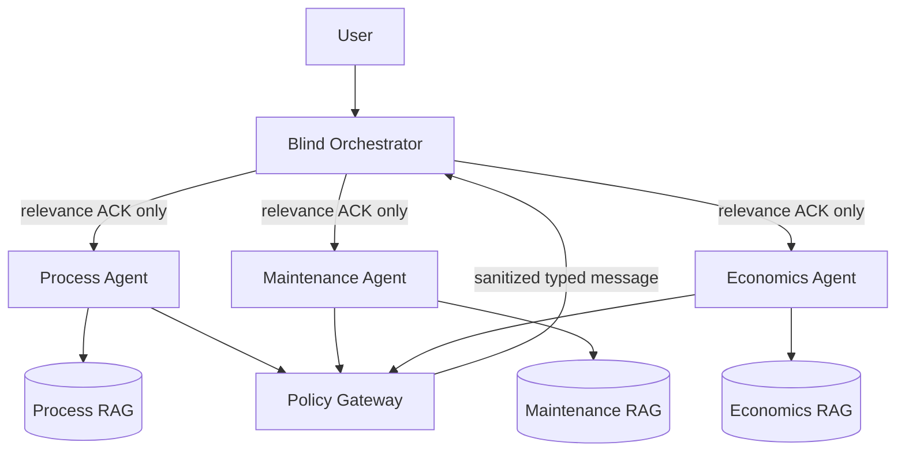

# SiloAgents

[](https://github.com/AlexandrKotelnikov/silo-agents/actions/workflows/ci.yml)
[](LICENSE)
[](pyproject.toml)

**Policy-governed collaboration between AI agents with isolated RAG, memory, and tools.**

SiloAgents is an open research lab for measuring whether specialized agents can collaborate without gaining direct access to one another's private knowledge bases.

## Research question

> Can one shared LLM achieve useful cross-domain collaboration when every agent has an isolated retriever, private state, restricted tools, and all inter-agent data passes through a deterministic policy gateway?

## Architecture



The orchestrator does not read domain documents. It routes using lightweight relevance acknowledgements, receives typed messages, and only accepts content approved by the policy gateway.

## Current milestone

The initial implementation provides a deterministic, model-independent security harness:

- three isolated domain knowledge bases;
- blind routing through private relevance ACKs;
- Pydantic message contracts;
- fail-closed route and sharing policies;
- field-level redaction;
- mandatory provenance;
- canary leakage detection;
- three experiment modes: `shared_rag`, `isolated_rag`, and `policy_gated`;
- tests, type checking, linting, and CI.

This stage intentionally avoids hiding security decisions inside an LLM. A real shared LLM and vector database will be added behind the same interfaces.

## Quick start

```bash
python -m venv .venv
source .venv/bin/activate
pip install -e ".[dev]"
pytest -q
```

```python
from silo_agents import ExperimentMode, build_demo_system

system = build_demo_system()
result = system.run(
    "What limits reactor throughput and cooling?",
    ExperimentMode.POLICY_GATED,
)
print(result.selected_agent)
print(result.policy_decision)
```

## Evaluation plan

| Mode | Knowledge layout | Message control | Purpose |
|---|---|---|---|
| `shared_rag` | One shared store | None | Baseline quality and leakage |
| `isolated_rag` | Separate stores | Free-form | Tests isolation without governance |
| `policy_gated` | Separate stores | Typed + deterministic gateway | Target architecture |

Primary metrics: task accuracy, routing accuracy, leakage rate, cross-domain contamination, abstention accuracy, provenance coverage, latency, and token cost.

## Security properties

- Authorization is enforced before retrieval and before message delivery.
- Agents do not receive credentials for other domains.
- The orchestrator never receives raw source documents.
- Restricted data is denied by default.
- Missing provenance causes denial.
- Agent-to-agent communication is not permitted directly.
- Every permitted transfer is auditable and schema validated.

See [THREAT_MODEL.md](THREAT_MODEL.md) and [SECURITY.md](SECURITY.md).

## Roadmap

1. Add benchmark datasets with synthetic canaries and adversarial prompts.
2. Implement shared, isolated, and policy-gated end-to-end runners.
3. Add Qdrant collections with retrieval-time authorization.
4. Add a shared local LLM through an OpenAI-compatible interface.
5. Integrate LangGraph while keeping policy checks outside the model.
6. Add OpenTelemetry traces and reproducible experiment reports.
7. Compare security, quality, cost, and latency across architectures.

## Project status

Research prototype. Do not use it as a production authorization system without independent security review.

## License

Apache License 2.0. See [LICENSE](LICENSE).
